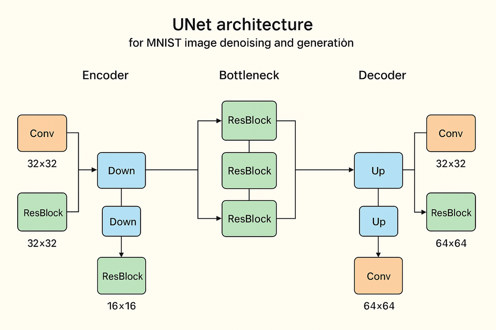

# Denoising-Diffusion-Model-for-Handwritten-Digit-Synthesis

## Overview

Ever wondered how AI generates images from nothing? This project **deconstructs the "magic" behind diffusion models** by building one completely from scratch.

Starting with pure random noise, the model learns to sculpt recognizable handwritten digits through a carefully orchestrated denoising process. No black-box libraries, every component from the U-Net architecture to the noise scheduler is implemented from first principles using PyTorch.

It implements:
- **U-Net architecture** with residual blocks, skip connections, and ~1.2M parameters
- **DDPM scheduler** with forward/reverse diffusion processes
- **Dual sampling**: DDPM (1000-step) and DDIM (50-step, 20x faster)
- **Class-conditional generation** for controlled digit synthesis (0-9)
- **Interactive Gradio app** for real-time generation

**Key Achievement:** 95% reduction in sampling steps while maintaining quality.

## Architecture

  
  
<i>U-Net architecture with encoder-decoder structure</i>

## Inspiration

Diffusion models have revolutionized generative AI, powering tools like DALL-E, Midjourney, and Stable Diffusion. But how do they actually work under the hood?

I wanted to understand the fundamentals - not just use pre-built libraries, but implement the entire pipeline from scratch. This project demystifies diffusion models by building one step-by-step: the forward noising process, the reverse denoising process, the U-Net architecture, and both DDPM and DDIM sampling strategies.

The goal wasn't just to generate digits - it was to deeply understand how these models learn to create structure from pure noise.

